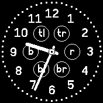
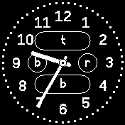

# banglejs-2-complication-placeholder #

just a placeholder for the complications of an analog clock on Bangle.js 2

Instead of a real "complication", this module just draws a placeholder for such a complication into the face of an analog clock running on a [Bangle.js 2](https://www.espruino.com/Bangle.js2).

<table>
 <tr valign="top">
   <td align="center"><br>for small complications only</td>
   <td align="center"><br>for small and large complications</td>
 </tr>
</table>

## Usage ##

Within a clock implementation, the module may be used as follows:

```javascript
let Placeholder = require('https://raw.githubusercontent.com/rozek/banglejs-2-complication-placeholder/main/Complication.js');

let Clockwork = require(...);
Clockwork.windUp({
  complications:{
    tl:Placeholder.withLabel('tl'),
    r:Placeholder,
  }
});
```

In the simplest case, the placeholder is just used "as-is" and draws a border around the region, which is allocated to a complication at the given position.

You may, however, also specify a label to be drawn within that border - in that case, use `Placeholder.withLabel('<label>')` instead. This variant may help you to figure out whether a given text will fit into the complication's area or not.

## License ##

[MIT License](LICENSE.md)
